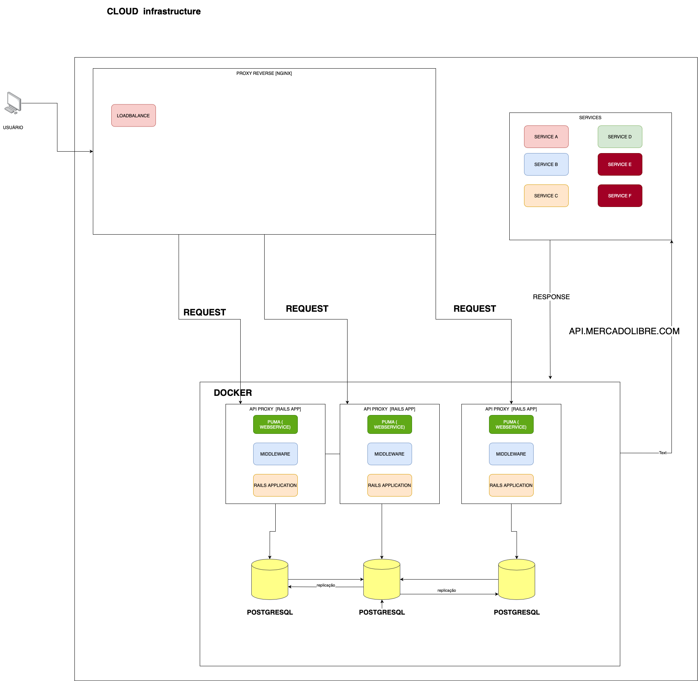

# API GATEWAY

The project is an api gateway for external access to api.mercadolibre.com


## Technical Challenge

There are more than 30,000 servers on the **mercadolibre** where the applications are run.

There is communication bettwen each service through endpoints(API).

There are APIs with access external through **api.mercadolibre.com**.

The client makes the request through api.mercadolibre.com for the desired resource and the API GATEWAY must send the request for the desired service.


#### UseCase

1. Control the maximum value of requests
 - By origin IP
 - By destination
 - Combination of both
 - Other control criteria or alternative
2. Store and consult api proxy usage statisics
3. Code on Github
4. The proxy must exceed 50,0000 requests per second.

## About

The project have a Makefile to learn more about click on the link. [Makefile](https://www.embarcados.com.br/introducao-ao-makefile/)

## Architecture



#### Link:

[Draw.io](https://drive.google.com/file/d/1jd8_V3JplLRqmKcjgvszPqJV6E7GL09o/view?usp=sharing)

## Setup

Execute the command:

```shell
  bin/setup
```

Add data for test

```
  bin/rails db:seed
```

## Environment dependencies

  * Ruby 2.7.3
  * BUNDLER 2.2.21
  * Rack Attack
  * Rack Proxy
## OpenAPI 3.0 with Documentation

To check the documentation with the apis go to: `http://localhost:3000/api-docs`.

To generation documentation with OpenAPI 3.0 specification use:

```
  make generate_document_api
```

or

```
  bundle exec rails rswag:specs:swaggerize
```

## Run Tests

```
  make test
```
## Run Server

```
  make server
```

## How to use

Information about data

```ruby
    "remote_ip" # The ip of the request
    "max_request_origin_ip" # Maximum requisition quantity
    "destination_path"
    "email"
    "token"
    "acceptance_criteria" # Criteria to select which type of criteria will be checked example: "remote_ip,email" or "email"
    "period_seconds" # Time period for each request in seconds.
```

This is ApacheBench, about it [Link](http://manpages.ubuntu.com/manpages/bionic/man1/ab.1.html).

Make many requests. Where -n is the number of requests and -c is the number concurrency.

Example:

```shell
  ab -n 20 -c 2 'http://localhost:3000/api/v1/services2'
```

```
       ab [ -A auth-username:password ] [ -b windowsize ] [ -B local-address ] [ -c concurrency ]
       [ -C cookie-name=value ] [ -d ] [ -e csv-file ] [ -f protocol ] [ -g gnuplot-file ] [ -h ]
       [  -H  custom-header  ] [ -i ] [ -k ] [ -l ] [ -m HTTP-method ] [ -n requests ] [ -p POST-
       file ] [ -P proxy-auth-username:password ] [ -q ] [ -r ] [ -s  timeout  ]  [  -S  ]  [  -t
       timelimit  ]  [  -T  content-type  ]  [  -u  PUT-file ] [ -v verbosity] [ -V ] [ -w ] [ -x
       <table>-attributes ] [ -X proxy[:port] ] [ -y <tr>-attributes ] [ -z <td>-attributes  ]  [
       -Z ciphersuite ] [http[s]://]hostname[:port]/path

```